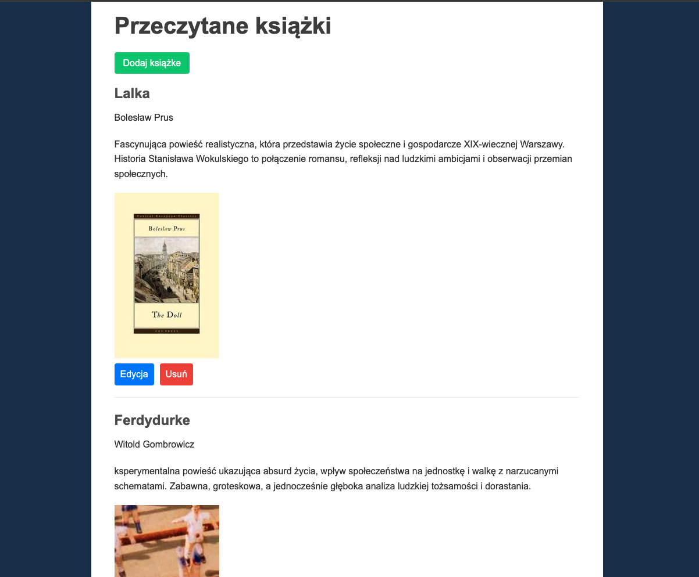

# Book Notes

## Table of Contents
- [Overview](#overview)
- [The Challenge](#the-challenge)
- [Screenshot](#screenshot)
- [Links](#links)
- [My Process](#my-process)
- [Built With](#built-with)
- [What I Learned](#what-i-learned)
- [Installation & Setup](#installation--setup)
- [Author](#author)

## Overview
**Book Notes** is a web application that allows users to manage their list of read books. Users can add new books, edit details, delete entries, and view book covers fetched automatically from the Open Library API.

## The Challenge
Users should be able to:
- Add a book to the list by providing its title, author, and review.
- Automatically fetch a book cover from the Open Library Covers API based on the title.
- Edit the details of a previously added book.
- Delete a book from the list.
- View the entire collection of books.

## Screenshot


## Links
- [GitHub Repository](https://github.com/SebastianJast/Book_Notes.git)

## My Process
### Built With
- **Backend:** Node.js with Express
- **Frontend:** HTML, CSS, EJS (templating engine)
- **Database:** PostgreSQL
- **API Integration:** Open Library Covers API

### What I Learned
During this project, I improved my skills in:
- **Backend Development:** Setting up RESTful routes and handling requests in Express.js.
- **Database Management:** Working with PostgreSQL for storing and querying book data.
- **Frontend Development:** Using EJS for dynamic rendering of data.
- **API Integration:** Fetching data from Open Library Covers API to display book covers dynamically.
- **CRUD Operations:** Implementing Create, Read, Update, and Delete functionalities for book entries.

## Installation & Setup
To run this project locally, follow these steps:

1. **Clone the repository:**
   ```bash
   `git clone https://github.com/SebastianJast/Book_Notes.git`

2. **Navigate to the project directory:**
    `cd book-notes`

3. **Install dependencies:**
    `npm install`

4. **Set up the database:**
    Create a PostgreSQL database named booklist.
    Add a books table with the following structure:
    
    ```SQL
    CREATE TABLE books (
        id SERIAL PRIMARY KEY,
        title TEXT,
        author TEXT,
        review TEXT,
        img TEXT
    );

5. **Update database credentials in the code:**

    Edit the pg.Client configuration in index.js to match your PostgreSQL credentials:

    ```javascript
    const db = new pg.Client({
        user: "yourusername",
        host: "localhost",
        database: "booklist",
        password: "yourpassword",
        port: 5432,
    });

6. **Run the application:**
    `node index.js`

7. **Open the app in your browser:**
    Navigate to http://localhost:3000

## Author
- GitHub - [@SebastianJast](https://github.com/SebastianJast)
- Website - [Sebastian](https://sebastianjast.github.io/Responsive_CV/)